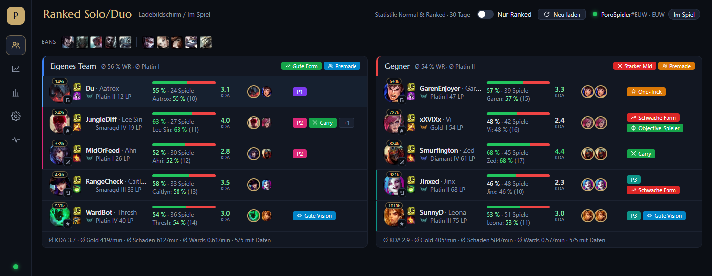
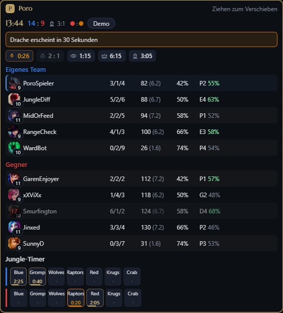

# Poro – League of Legends Companion (Porofessor-Klon)

Poro ist ein Windows-Desktop-Begleiter für League of Legends. Die App verbindet sich lokal mit dem League Client
und bündelt Lobby-Analyse, Champion-Select-Werkzeuge, Live-Overlay und Post-Game-Auswertung in einer kompakten
Hextech-Oberfläche. Auf einen Blick werden unter anderem Rang, Winrate, KDA, Champion-Erfahrung, Hauptrollen,
Premades, Player Tags, Team-Statistiken, Objectives und Jungle-Timer sichtbar.

Die wichtigsten Daten kommen direkt aus der lokalen LCU- und Live-Client-API. Ein eigener Riot-API-Key ist
optional und ergänzt die persönliche Match-History, detaillierte Post-Game-Timelines sowie lokale Meta-Daten.

<p align="center">
  <a href="https://github.com/ErlangCPT/lol-poro/releases/latest"></a>
  <a href="https://discord.com/channels/@me"></a>
</p>

Kontakt: Öffne Discord über den Badge und füge **`abschiebung_`** als Freund hinzu.

## Screenshots

### Lobby-Analyse

Zehn Spieler, Rollen, aktuelle Form, Champion-Statistiken, Premades und auffällige Spielmuster in einer Ansicht.



### In-Game-Overlay

Kompakte Objective-, Spieler- und Jungle-Timer, ohne dem Spiel den Tastaturfokus zu nehmen.

<p align="center">
  
</p>

Alle sichtbaren Spielernamen und Werte in den Screenshots sind synthetische Demo-Daten.

Dokumentation:

- `docs/01-porofessor-analyse.md` – was Porofessor tut, Riot-Policy-Grenzen, verifizierte APIs
- `docs/02-implementation-plan.md` – Architektur und Phasenplan

## Voraussetzungen

- Node.js >= 22, pnpm 9
- League of Legends (Windows); die App findet den Client automatisch über den laufenden Prozess oder das Lockfile

## Entwicklung

```bash
pnpm install
pnpm dev            # Electron mit Hot Reload
pnpm test           # Unit-Tests (Vitest)
pnpm typecheck      # TypeScript in allen Paketen
pnpm build          # Produktions-Build nach apps/desktop/out
pnpm dist:win       # Windows-Installer (electron-builder) nach apps/desktop/release
```

Der Installer (`Poro Setup <version>.exe`, App-Icon aus `apps/desktop/build/icon.png`) installiert nach
`%LOCALAPPDATA%\Programs\Poro` und legt Verknüpfungen auf dem Desktop und im Startmenü an; `/S` installiert still.
Die installierte App nutzt dieselben Laufzeitdaten unter `%APPDATA%\Poro` wie `pnpm dev`.

Entwickler-Flags für die gebaute App (`cd apps/desktop && ./node_modules/.bin/electron . <flag>`):

- `--demo` zeigt eine synthetische Lobby ohne laufenden League Client
- `--replay-last-game` analysiert direkt nach dem Verbinden das letzte Spiel des eingeloggten Accounts
- `--postgame-last` öffnet direkt nach dem Verbinden die Post-Game-Auswertung des letzten Spiels
- `--demo-live` simuliert ein laufendes Spiel ab Minute 13:40 (Overlay und In-Game-Panel ohne League)
- `--screenshot-overlay=C:\pfad\bild.png` speichert das Overlay-Fenster als PNG und beendet die App
- `--screenshot=C:\pfad\bild.png` rendert das Fenster, speichert ein PNG und beendet die App
  (`--screenshot-delay=30000` wartet vorher die angegebenen Millisekunden)

## In-Game-Overlay

Sobald ein Spiel läuft (Live Client Data API auf Port 2999 antwortet), öffnet Poro ein transparentes,
immer-im-Vordergrund-Fenster mit Objective-Timern, Live-Stats beider Teams und Jungle-Timern. Es ist standardmäßig
durchklickbar:

- Verschieben per Drag & Drop, ohne Hotkey: Sobald die Maus auf der Kopfzeile oder einem Button steht, nimmt das
  Overlay die Maus an (Rahmen wird golden) — Kopfzeile mit gedrückter Maustaste ziehen, Jungle-Camps per Klick
  markieren (zweiter Klick löscht den Timer). Überall sonst bleiben die Klicks beim Spiel, und das Spiel behält
  auch beim Ziehen die Tastatur (das Overlay-Fenster nimmt keinen Fokus).
- `Ctrl+Shift+P` blendet das Overlay ein oder aus. Deckkraft, Größe, Ton und Inhalt stehen in den Einstellungen.
- League muss im Modus "Randlos" oder "Fenster" laufen. Bei exklusivem Vollbild zeigt Poro einen Hinweis.
- Position: automatisch neben dem Spielfenster, wenn der Monitor dort Platz hat (z. B. mit LoL 27, das das Spiel
  auf 27 Zoll verkleinert und den Rand abdunkelt), sonst klein am linken Rand innerhalb des Spiels. Einmal
  verschoben bleibt es an der Stelle, bis "Overlay-Position zurücksetzen" gedrückt wird. Standard: 80 % Größe,
  70 % Deckkraft.
- Dieselben Daten erscheinen im Hauptfenster oben im Tab Lobby-Analyse, z. B. für einen zweiten Monitor.

## Oberfläche

Das Design ("Hextech-Datentafel") liegt als Token-Set in `apps/desktop/src/renderer/src/styles.css`: dunkle
Flächen, Gold-Hairlines, Marcellus als Titelschrift (gebündelt, SIL Open Font License), Segoe UI für Text, SVG-Icons
statt Emoji. Aufbau: 64 px breite Icon-Leiste links (Lobby, Post-Game, Meta, Einstellungen, Diagnose, unten der
Verbindungspunkt), pro Seite eine Kopfzeile mit Titel, Aktionen und Riot-ID. Lobby: beide Teams als Karten
nebeneinander, pro Spieler eine Zeile mit Champion, Rolle, Spells, Rang, Winrate-Balken, KDA, Main-Champions und
Tags; ein Klick auf die Zeile öffnet die Details (12 h, CS/Gold/Schaden/Wards pro Minute, Meisterschaft, Flex-Rang,
Tag-Begründungen). Im Champion Select liegt darunter die Champion-Leiste mit Runen, Build, Counter/Bans, "Alles
importieren" und Reitern für Runen, Build, Matchups und Meta. Importergebnisse erscheinen als Toast unten rechts, der
Riot-Hinweis steht in den Einstellungen.

## Status

- Phase 0 (Fundament) und Phase 1 (Lobby-Analyse) sind implementiert: LCU-Verbindung mit Reconnect,
  Data Dragon, Cache, Stats-Aggregation, Rollen-Erkennung, Tag-Engine, Premade-Erkennung, Team Stats/Tags,
  React-UI mit Spielerkarten, Einstellungen, Diagnose, Session-Recorder.
- Phase 2 (Champ-Select-Werkzeuge) ist implementiert: Riots Runen-Empfehlungen mit Import, eigene Runenseiten
  und Builds aus der eigenen Historie mit Import (Runen, Spells, Item-Set), Matchup-Bilanz gegen die
  Gegner-Champions, Schadensprofil beider Teams, "Letztes Spiel analysieren" als Post-Game-Review.
- Riot-API-Client (`packages/riot-api`) mit Rate-Limiter ist vorgezogen: Match-V5 liefert die eigene
  30-Tage-Historie, weil der Client für den eigenen Account nur wenige Spiele bereitstellt.
- Gegen den echten Client verifiziert: Verbindung, Spielerdaten aller 10 Teilnehmer, Runenseiten anlegen/löschen,
  Runen-Empfehlungen, Item-Set-Format (siehe `docs/01-porofessor-analyse.md`, Abschnitt 4.1.1).
- Phase 3 (In-Game) ist implementiert: `packages/live-client` pollt die Live Client Data API, Objective-Timer
  (Drache/Soul/Ältester, Leerenbruten, Herold, Baron, Inhibitoren), Live-Stats (KDA, CS/min, Kill-Beteiligung,
  CS und Wards @10/@20, Itemwert, Rang und Winrate aus der Lobby-Analyse), manuelle Jungle-Timer, transparentes
  Overlay (Drag & Drop direkt an der Kopfzeile, Ctrl+Shift+P ein/aus), optionalem Ton vor Spawns und
  Hinweis bei exklusivem Vollbild. Bisher nur mit `--demo-live` geprüft.
- Phase 4 (Post-Game) ist implementiert: Nach jedem Spiel (und per "Letztes Spiel analysieren") entsteht die
  Auswertung aus dem Client, mit Riot-API-Key ergänzt um Match-V5 und Timeline: Gold-, CS- und XP-Verlauf gegen
  den Lane-Gegner, Lane-Differenz bei 10/15/20, Team-Gold-Differenz, Schadensverteilung, Vision, Objectives mit
  Beteiligung, Tode mit Killer, Vergleich zum eigenen 30-Tage-Schnitt und Trend der letzten 20 Spiele. Die
  Spielhistorie liegt in SQLite (`%APPDATA%\Poro\history.sqlite`, `node:sqlite`, kein natives Modul) und wird
  beim ersten Start mit Key automatisch mit den letzten 20 Spielen gefüllt. Gegen echte Daten geprüft.
- Phase 5 (Statistik-Pipeline) ist implementiert: `packages/stats` mit Crawler (Rangliste Smaragd bis Challenger →
  Spieler → Match-IDs → Matches des aktuellen Patches, ~40 Anfragen/Minute, nur solange Poro läuft), SQLite-Store
  (`%APPDATA%\Poro\stats.sqlite`), Aggregation zu Winrate/Pickrate/Banrate mit Tier pro Rolle, Matchups, Counter-Picks,
  Ban-Vorschlägen (Counter deiner Main-Champions plus Meta-Bans) und Meta-Builds (Core-Items, Stiefel, Runen, Spells)
  mit Import im Champion Select. Tab "Meta" mit Tier-Liste und Crawler-Status. Gegen die echte API geprüft.
- Oberfläche neu gestaltet (03.09.2026): Sidebar-Navigation, Team-Karten mit Spielerzeilen und Detailansicht,
  Champion-Leiste mit "Alles importieren", Meta-Tabelle mit Suche und Sortierung, Einstellungen in Gruppen, Overlay mit
  SVG-Icons und Fortschrittsbalken der Jungle-Camps; das Overlay-Fenster schrumpft jetzt auch wieder auf die Inhaltshöhe.
- Phase 6 (Politur, 03.09.2026): Auto-Update über einen eigenen HTTPS-Ordner (generic provider, Adresse in den
  Einstellungen, Prüfung beim Start, Installation beim Beenden oder per Klick), lokale Absturzberichte
  (`%APPDATA%Porocrashes`, Main-Prozess, Renderer, abgestürzte Prozesse; nichts wird hochgeladen), Export und
  Import der Einstellungen als JSON (ohne API-Key), frei belegbare Overlay-Hotkeys mit Konfliktanzeige, helles und
  dunkles Design (auch "wie Windows"), Pro-Spieler-Liste (`pros.json`, Tag "Pro" in der Lobby), Prozess-CPU in der
  Diagnose (Ziel Overlay unter 2 %), Installer-Signierung über die electron-builder-Umgebungsvariablen vorbereitet.
  Discord Rich Presence wurde weggelassen (optional laut Plan, braucht eine eigene Discord-App-ID).
- Später (bewusst verschoben): Discord Rich Presence. Zeigt im Discord-Profil "Spielt League of Legends" mit
  Phase, Champion und Spielzeit. Braucht eine eigene Anwendung im Discord Developer Portal (App-ID plus Icon);
  Umsetzung: Schalter "Discord-Status anzeigen" in den Einstellungen, Verbindung über die lokale Discord-IPC-Pipe,
  Status aus Gameflow-Phase und Live-Daten, still, wenn Discord nicht läuft.
- Noch offen: Abnahme im echten Champion Select (Normal Draft und Ranked Solo) und im echten Spiel (Event-Namen
  der Live-API, Overlay über dem Spielfenster), Kalibrierung der Tag-Schwellen; die Tier-Liste braucht ein paar hundert Matches pro Patch, bis sie belastbar ist.

## Updates, Signierung, Absturzberichte

- **Auto-Update:** `pnpm dist:win` erzeugt in `apps/desktop/release` neben dem Installer `latest.yml` und eine
  `.blockmap`. Diese drei Dateien in einen HTTPS-Ordner legen und dessen Adresse in Poro unter Einstellungen →
  Updates eintragen. Poro prüft beim Start (abschaltbar) und auf Klick, lädt im Hintergrund und installiert beim
  nächsten Beenden oder sofort über "Neu starten und installieren". Ohne Adresse findet keine Prüfung statt.
- **Signierung:** electron-builder signiert den Installer automatisch, wenn `CSC_LINK` (Pfad oder Base64 der
  .pfx-Datei) und `CSC_KEY_PASSWORD` gesetzt sind. Ohne Zertifikat bleibt der Installer unsigniert und SmartScreen
  warnt beim ersten Start.
- **Absturzberichte:** Unbehandelte Fehler des Main-Prozesses, Fehler aus Fenstern und abgestürzte Prozesse landen
  als JSON in `%APPDATA%Porocrashes` (die letzten 50), Chromium-Minidumps im Electron-Ordner `crashDumps`.
  Es wird nichts hochgeladen. Die Diagnose zeigt Anzahl, Ordner und die CPU-Last der Prozesse.
- **Einstellungen sichern:** Einstellungen → Sicherung exportiert alles außer dem Riot-API-Key und der
  Overlay-Position als JSON und importiert solche Dateien wieder.
- **Pro-Spieler:** `%APPDATA%Poropros.json` ordnet Riot-IDs ("Name#TAG") oder PUUIDs einem Anzeigenamen zu;
  Treffer bekommen in der Lobby den Tag "Pro". Poro liefert keine Liste mit, weil Pro-Accounts ständig wechseln.

## Struktur

```
apps/desktop          Electron-App (main = Services/IPC, preload = Bridge, renderer = React-UI)
packages/core         Domänenlogik: Aggregation, Rollen-Erkennung, Tag-Engine, Premades, Team-Tags, Live-Timer, Post-Game-Metriken
packages/lcu          LCU-Client: Discovery, REST, WebSocket, Reconnect, Normalisierung, Runen-/Item-Set-Import
packages/live-client   Live Client Data API (Port 2999): Client, Poller mit Event-Diff
packages/riot-api     Riot-API-Client: Routing, Rate-Limiter, Account-V1, Match-V5 inkl. Normalisierung, Timeline-Adapter
packages/stats        Statistik-Pipeline: Match-Extraktion, Aggregation (Tier, Matchups, Builds), Crawler
packages/static-data  Data Dragon (Champions, Spells, Bild-URLs) mit versioniertem Cache
packages/storage      JSON-Cache mit TTL, Settings-Store, SQLite-Spielhistorie und Statistik-Store
```

## Laufzeitdaten

Unter `%APPDATA%\Poro`:

- `settings.json` – Einstellungen (inkl. optionalem Riot-API-Key, nur lokal)
- `cache/` – Spielerdaten mit TTL (Summoner 24 h, Ranked 30 min, Matchliste 15 min, Mastery 6 h)
- `history.sqlite` – Post-Game-Berichte und Trend (SQLite)
- `stats.sqlite` – gecrawlte Ranked-Matches des Patches und Crawl-Warteschlange (SQLite)
- `static/` – Data-Dragon-Snapshots pro Patch
- `logs/main.log` – Log des Hauptprozesses
- `recordings/` – Rohdaten aufgezeichneter Sessions (Einstellung "Sessions aufzeichnen"), als Test-Fixtures nutzbar

## Riot-Policy

Die App zeigt im Ranked Solo/Duo Champion Select keine Daten fremder Mitspieler (der Client liefert sie nicht),
die volle 10-Spieler-Analyse erscheint ab dem Ladebildschirm. Keine Ultimate-Timer, keine gegnerischen
Spell-Timer, keine Power-Spike-Hinweise. Details in `docs/01-porofessor-analyse.md`, Abschnitt 5.

Poro isn't endorsed by Riot Games and doesn't reflect the views or opinions of Riot Games or anyone officially
involved in producing or managing Riot Games properties.
